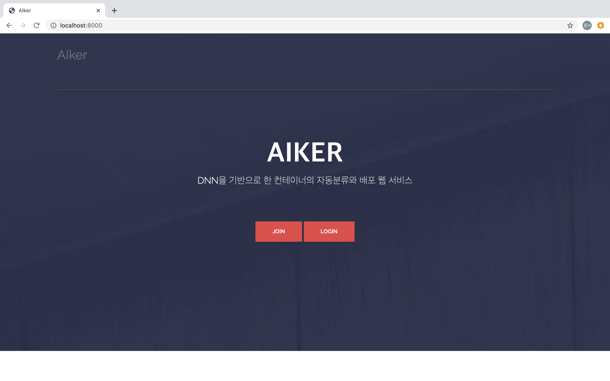
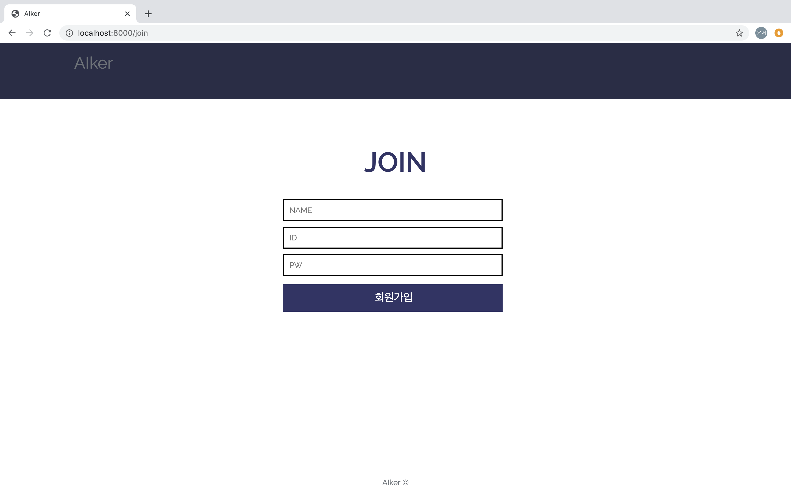
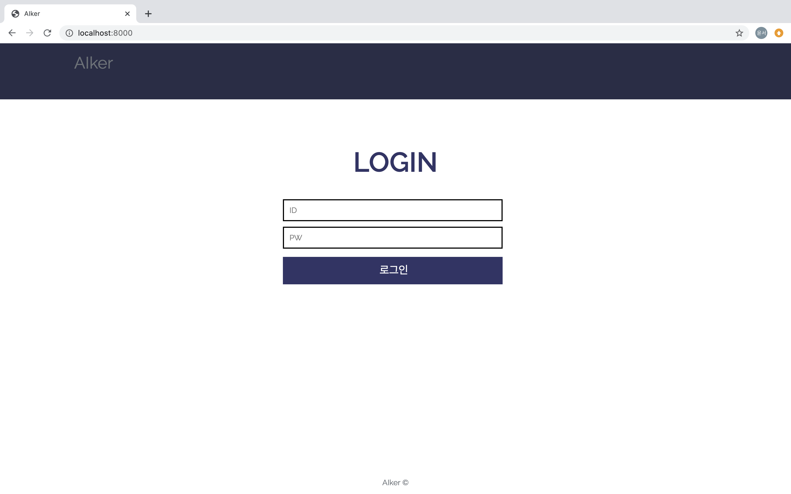

# What is Aiker?   
</img>   

* * *   

# Logic   
1. Create Docker Container   
</img>    

>	docker hub에서 docker image를 다운받아, 웹에서 넘어온 정보를 토대로 docker daemon을 통해 컨테이너 생성.   

2. List Docker Container   
</img>   

>	웹에서 바로 데이터베이스에 접근하여, 생성되어 있는 컨테이너의 리스트 show.   

3. Delete Docker Container   
</img>   

>	웹에서 바로 데이터베이스에 접근하여, 해당 컨테이너 delete.   

* * *

# Classifier 
</img>

> 도커 컨테이너 200개 생성 기준으로 정확도 96%, loss 0.3 으로 마무리.

# 실행가이드 
실행 전 node js는 12.18.3 npm은 6.14.7 yarn은 1.22.4 버전을 사용했습니다.
1. node js를 설치하여 node js와 npm을 설치해준다.
2. npm install yarn -g 로 yarn 설치
3. 터미널에 yarn build 입력
4. yarn start 로 시작
5. 주소창에 localhost:8000
6. 메인페이지 (회원가입, 로그인)
</img>
</img>
</img>

> 메인페이지에서 회원가입과 로그인을 해줍니다.
